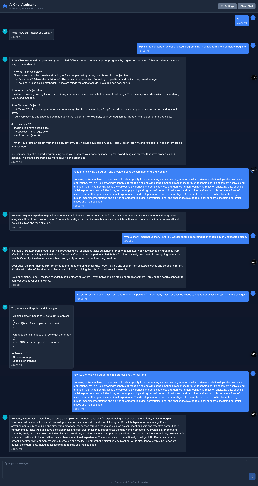
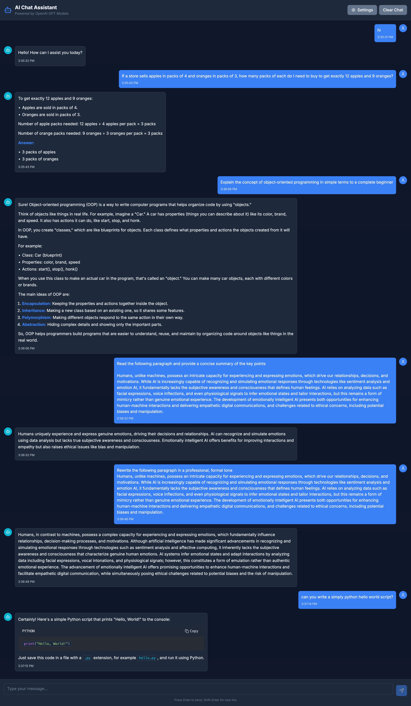

## 🚀 Project Showcase

### 📋 Base Assignment

*Starting point: A functional FastAPI backend with OpenAI integration*

### ✨ Advanced Build  

*Final result: Beautiful modern frontend with rich text rendering, syntax highlighting, math formulas, API key validation, and seamless UX*

**Key Features Added:**
- 🎨 Modern dark theme with excellent contrast
- 💬 Real-time streaming responses
- 🔐 Secure API key validation
- 💻 Syntax highlighted code blocks with copy functionality
- 🧮 LaTeX/KaTeX math formula rendering
- 📱 Responsive design that works on all devices
- ⌨️ Smart focus management and keyboard shortcuts
- 🎛️ Customizable settings and model selection
