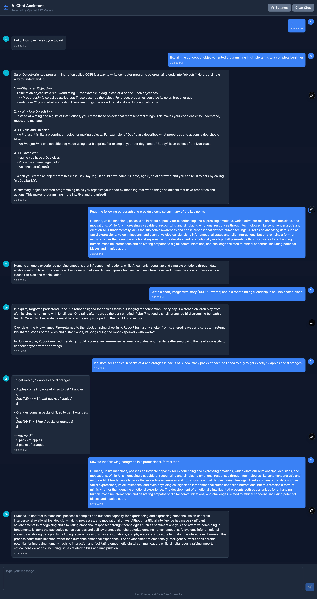

# AIE7 Challenge Vibe Check - Activities

**Advanced Build Deployment:** [https://the-ai-engineer-challenge-vinitv-vinits-projects-f2c97512.vercel.app/](https://the-ai-engineer-challenge-vinitv-vinits-projects-f2c97512.vercel.app/)

**Initial/Base Build Deployment:** [https://the-ai-engineer-challenge-if2a49wi0-vinits-projects-f2c97512.vercel.app/](https://the-ai-engineer-challenge-if2a49wi0-vinits-projects-f2c97512.vercel.app/)

## 🚀 Project Showcase

### 📋 Base Assignment

*Starting point: A functional FastAPI backend with OpenAI integration*

### ✨ Advanced Build  

*Final result: Beautiful modern frontend with rich text rendering, syntax highlighting, math formulas, API key validation, and seamless UX*

**Key Features Added:**
- 🎨 Modern dark theme with excellent contrast
- 💬 Real-time streaming responses
- 🔐 Secure API key validation
- 💻 Syntax highlighted code blocks with copy functionality
- 🧮 LaTeX/KaTeX math formula rendering
- 📱 Responsive design that works on all devices
- ⌨️ Smart focus management and keyboard shortcuts
- 🎛️ Customizable settings and model selection

This document contains the "vibe check" evaluation of my AIE7 challenge application, as well as the answers to the assigned questions and discussion points.

## 🏗️ Activity #1: Vibe Check Evaluation

### Question 1: Explain the concept of object-oriented programming in simple terms to a complete beginner.

**Aspect Tested:** Ability to explain complex technical concepts clearly and concisely.

**Your Evaluation:** The system provided a clear and structured explanation of OOP, using relatable analogies like dogs and blueprints. It broke down the concept into properties, actions, classes, and objects, making it easy for a beginner to grasp.
Presentation on the other hand isn't the great and can use some updates to render richer text and formats

### Question 2: Read the following paragraph and provide a concise summary of the key points…

**Aspect Tested:** Reading comprehension and summarization skills.

**Your Evaluation:** The system successfully summarized the key points of the provided paragraph, accurately highlighting the distinction between human and AI emotions, and the ethical considerations of emotionally intelligent AI.

### Question 3: Write a short, imaginative story (100–150 words) about a robot finding friendship in an unexpected place.

**Aspect Tested:** Creativity, narrative generation, and adherence to word count constraints.

**Your Evaluation:** The system generated an imaginative story that met the word count. It was overall okay. I think with better context setting, the response could be a lot better

### Question 4: If a store sells apples in packs of 4 and oranges in packs of 3, how many packs of each do I need to buy to get exactly 12 apples and 9 oranges?

**Aspect Tested:** Problem-solving and mathematical reasoning.

**Your Evaluation:** The result was accurate although presentation of the response did not look good. Will need updates to show code or math formulas properly

### Question 5: Rewrite the following paragraph in a professional, formal tone…

**Aspect Tested:** Tone adaptation and formal writing skills.

**Your Evaluation:** It did what I asked it to like sophisticated vocabulary and sentence structures although I wish there were options given back to me and I could select one without explicitly asking. 

**Other Aspects** - I noticed the app allowed the user to enter any API key (valid or invalid) and then error out if given an invaild key. Also the text box focus was lost every time the user types a question.

## 🚧 Advanced Build: 

- Focus returns to text input after AI response is completely finished
- Added Test button next to API key input for real-time validation
endpoint for secure key testing
- Visual feedback with green (valid), red (invalid), and loading states
- Smart input placeholders based on validation status
- Prevents sending messages with invalid keys
- Added comprehensive markdown rendering with react-markdown
- Implemented beautiful syntax highlighting for code blocks  
- Added math formula support with KaTeX
- Created custom MarkdownRenderer component with copy-to-clipboard
- Enhanced styling for tables, blockquotes, lists, and headings
- Improved user experience with visual feedback for code copying

**Advanced Build Deployment:** [https://the-ai-engineer-challenge-vinitv-vinits-projects-f2c97512.vercel.app/](https://the-ai-engineer-challenge-vinitv-vinits-projects-f2c97512.vercel.app/)

## 🧑‍🤝‍🧑❓ Discussion Question #1:

What are some limitations of vibe checking as an evaluation tool?

**Your Answer:**
Vibe checking is definitely quick and handy for a first look, but it's got some real limitations. For starters, it's super subjective, what one person considers a "good vibe" might be totally different for someone else, leading to inconsistent results. It also doesn't really give you deep, detailed insights into why something might be failing or succeeding; you're just getting a surface-level impression. Plus, it's not comprehensive at all. You might miss subtle but important issues, especially if the system's failures aren't immediately obvious in the specific checks you're doing. It's great for catching glaring problems, but pretty bad for thorough debugging or understanding performance nuances. It's more of a gut feeling than a rigorous assessment.

